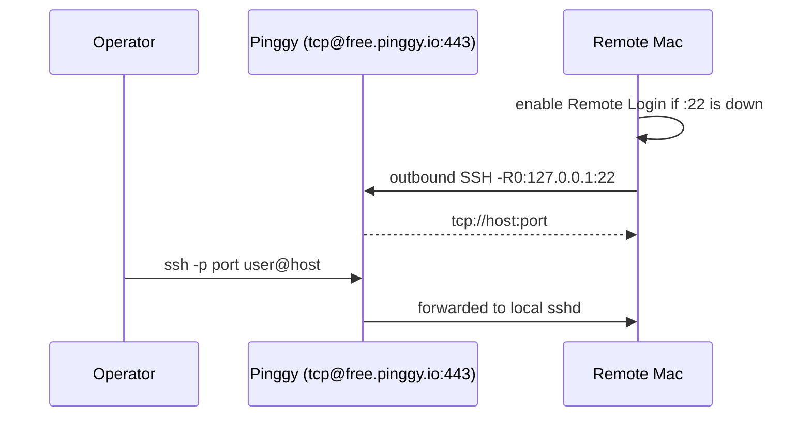

# mac-remote-bridge

Zero-config remote assistance for macOS. One command on the remote Mac
opens an encrypted reverse tunnel so you can SSH (and optionally share
the screen) from anywhere — CGNAT, hotel Wi-Fi, corporate NAT, no
router changes.

[](https://apple.com)
[](LICENSE)

> **This exposes a real login shell.** Anyone with the printed host:port
> *and* a password or SSH key for that Mac account can get in. Read
> [SECURITY.md](SECURITY.md) before you run it.

---

## Quick start (on the remote Mac)

Prefer the review-then-run form:

```bash
curl -fsSL https://raw.githubusercontent.com/chumafox/mac-remote-bridge/main/bridge.sh -o /tmp/bridge.sh
less /tmp/bridge.sh          # you should read a remote-access script
bash /tmp/bridge.sh
```

One-liner (prompts still go to the keyboard, not the curl pipe):

```bash
bash -c "$(curl -fsSL https://raw.githubusercontent.com/chumafox/mac-remote-bridge/main/bridge.sh)"
```

Or via short link:

```bash
bash -c "$(curl -fsSL https://clck.ru/3VCyvf)"
```

The script will:

1. Tell you exactly what it is about to enable and wait for Enter.
2. Turn on **Remote Login** only if port 22 is down (sudo, once).
3. Optionally turn on **Screen Sharing** (`--vnc`, or answer the prompt).
4. Open a background TCP tunnel to Pinggy and print the operator commands.

After that you can close Terminal. The tunnel keeps running.

```bash
~/.mac-remote-bridge/bridge.sh status
~/.mac-remote-bridge/bridge.sh stop
~/.mac-remote-bridge/bridge.sh revert    # also disable SSH/VNC if we turned them on
```

---

## Operator connection

### Terminal (SSH)

```bash
ssh -p <PORT> <USER>@<HOST>
```

### Desktop (VNC)

The remote Mac must have Screen Sharing on (`bridge.sh start --vnc`).
Then, on *your* machine:

```bash
ssh -L 5900:127.0.0.1:5900 -p <PORT> <USER>@<HOST>
```

Finder → **Cmd + K** → `vnc://127.0.0.1:5900`.

VNC is forwarded through the same SSH session. There is no second
public port.

---

## Commands

```
bridge.sh start          Enable SSH if needed and open a background tunnel
bridge.sh stop           Tear the tunnel down (SSH/VNC stay as they are)
bridge.sh status         Reprint host / port / commands
bridge.sh status --json  Machine-readable session
bridge.sh logs           Follow ~/.mac-remote-bridge/tunnel.log
bridge.sh revert         stop + disable services this tool enabled
bridge.sh doctor         sshd, VNC, FileVault, ACL, Pinggy reachability
```

Useful flags on `start`:

| Flag | Meaning |
| --- | --- |
| `-y`, `--yes` | Skip the confirmation prompt (still needs sudo if SSH is off) |
| `--vnc` | Enable Screen Sharing |
| `--allow-ip 203.0.113.10` | Broker-side IPv4/CIDR allow-list |
| `--token <PINGGY_TOKEN>` | Pinggy Pro (stable host, no 60-minute cap) |
| `--force` | Replace a healthy existing session |
| `--foreground` | Keep the tunnel in this terminal |
| `--lang ru` / `--lang en` | Force UI language (otherwise follows `LANG`) |

`PINGGY_TOKEN` and `PINGGY_HOST` are also honoured as environment
variables. State lives in `~/.mac-remote-bridge/` (`MRB_STATE_DIR`
overrides).

---

## How it works



Everything the Mac does is **outbound** on 443. No inbound port
forward, no extra client, no Homebrew.

The tunnel process is a small supervisor (`supervise.sh`) that:

- ignores `SIGHUP` so closing Terminal is safe;
- sends SSH keepalives every 30 seconds;
- restarts the broker connection if it drops and rewrites `session`;
- records PIDs so `stop` does not have to `pkill -f pinggy`.

Free Pinggy sessions last about **60 minutes** and get a new host:port
after a reconnect. `status` always shows the current one. A Pro token
gives a stable endpoint.

---

## Requirements

- macOS 10.15+ (Intel or Apple Silicon)
- Built-in `ssh`, `nc`, `sudo` — nothing else
- An administrator password *only* if Remote Login / Screen Sharing
  are currently off
- Outbound TCP 443 to Pinggy

`bridge.sh` is bash 3.2-compatible (the bash that ships on macOS).

---

## Security, briefly

- Confirmation is read from `/dev/tty`. `curl | bash` cannot auto-yes
  the banner.
- The broker SSH client ignores `~/.ssh/config` and does not offer
  your agent identities (`-F /dev/null`, `IdentityAgent=none`).
- Host keys are stored under `~/.mac-remote-bridge/known_hosts` with
  `StrictHostKeyChecking=accept-new` — not `no`.
- VNC is off unless you ask for it. We never flip on full ARD
  “all privileges”.
- `--allow-ip` is the single highest-leverage hardening flag. Use it
  when you know the operator’s public address.

Full write-up of the v1 findings and the v2 fixes: [SECURITY.md](SECURITY.md).

---

## Troubleshooting

| Symptom | What to do |
| --- | --- |
| `This tool only runs on macOS` | It is supposed to. Run it on the remote Mac. |
| Tunnel fails immediately | `bridge.sh doctor` — check `:22`, Pinggy `:443`, and `logs` |
| SSH is “on” but login is denied | The account may be missing from `com.apple.access_ssh`. `start` adds you; or System Settings → General → Sharing → Remote Login |
| VNC connection refused | Re-run with `--vnc`. Confirm `:5900` in `doctor`. |
| Session died after ~60 min | Free-tier limit. Re-run `start`, or pass `--token`. |
| FileVault + reboot | sshd will not come up until someone unlocks the disk locally. |

---

## Development

```bash
bash -n bridge.sh
bash bridge.sh __selftest
bash bridge.sh --help
```

`__selftest` covers URL/port parsing, Pinggy target construction, and
syntax of the generated supervisor. It runs on Linux and macOS.

---

## License

[MIT](LICENSE)
